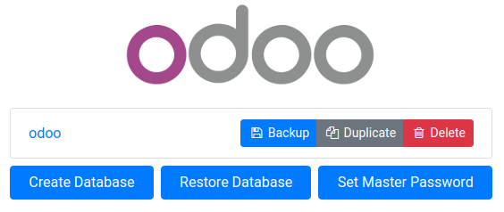

# Quick install

(Supports multiple Odoo instances on one server)

Install [docker](https://docs.docker.com/get-docker/) and [docker-compose](https://docs.docker.com/compose/install/) yourself, then run:

``` 
sudo bash run.sh <destination_dir> <odoo_port> <chat_port>
```

to set up first Odoo instance @ `localhost:<odoo_port>` (default master password: `password123`)

to set up another Odoo instance, simply run the previous command again, providing different (unused) ports
and a different installation directory.

Some arguments:
* First argument: Odoo deploy folder
* Second argument: Odoo port
* Third argument: live chat port

# Usage

Start the container:
``` sh
docker-compose up
```

* Then open `localhost:9000` to access Odoo 15.0. If you want to start the server with a different port, change **9000** to another value in **docker-compose.yml**:

```
ports:
 - "9000:8069"
```

Run Odoo container in detached mode (be able to close terminal without stopping Odoo):

```
docker-compose up -d
```

Increase maximum number of files watching from 8192 (default) to **524288**. In order to avoid error when we run multiple Odoo instances. This is an *optional step*. These commands are for Ubuntu user:

```
$ if grep -qF "fs.inotify.max_user_watches" /etc/sysctl.conf; then echo $(grep -F "fs.inotify.max_user_watches" /etc/sysctl.conf); else echo "fs.inotify.max_user_watches = 524288" | sudo tee -a /etc/sysctl.conf; fi
$ sudo sysctl -p    # apply new config immediately
```

# Custom addons

The **addons/** folder contains custom addons. Just put your custom addons if you have any.

# Backup and Restore existing Odoo database

Odoo's database can be backed up and restored by navigating to http:localhost:9000/web/database/manager


# Odoo configuration & log

* To change Odoo configuration, edit file: **etc/odoo.conf**.
* Log file: **etc/odoo-server.log**
* Default database password (**admin_passwd**) is `password123`, please change it @ [etc/odoo.conf#L60](/etc/odoo.conf#L60)

# Odoo container management

**Run Odoo**:

``` bash
docker-compose up -d
```

**Restart Odoo**:

``` bash
docker-compose restart
```

**Stop Odoo**:

``` bash
docker-compose down
```

# Live chat

In [docker-compose.yml#L21](docker-compose.yml#L21), we exposed port **20014** for live-chat on host.

Configuring **nginx** to activate live chat feature (in production):

``` conf
#...
server {
    #...
    location /longpolling/ {
        proxy_pass http://0.0.0.0:20014/longpolling/;
    }
    #...
}
#...
```
